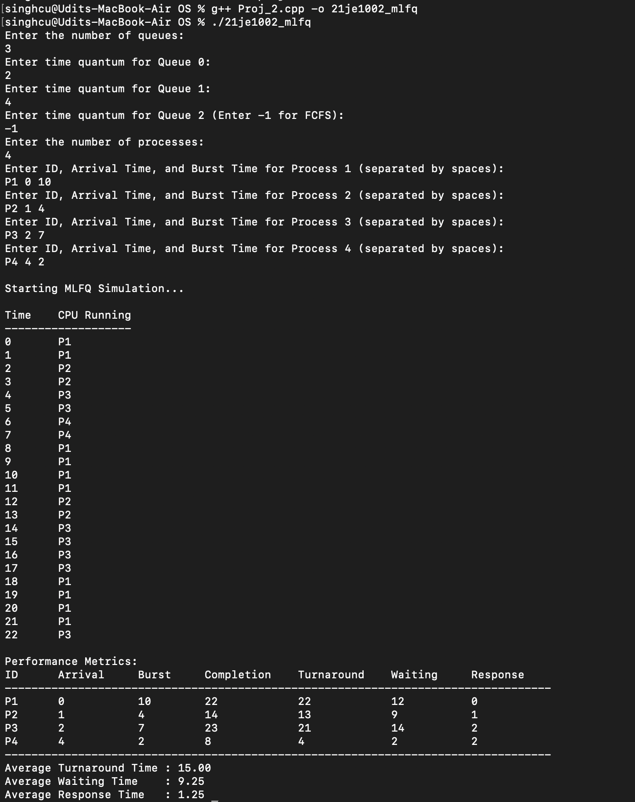
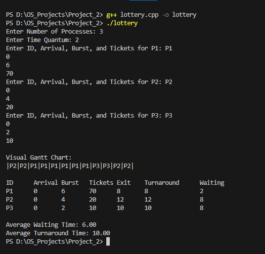
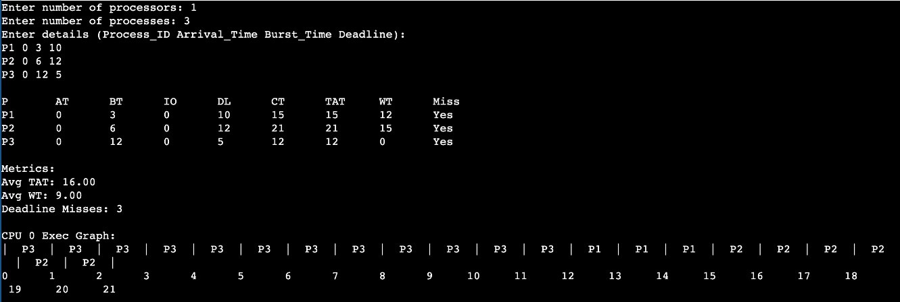
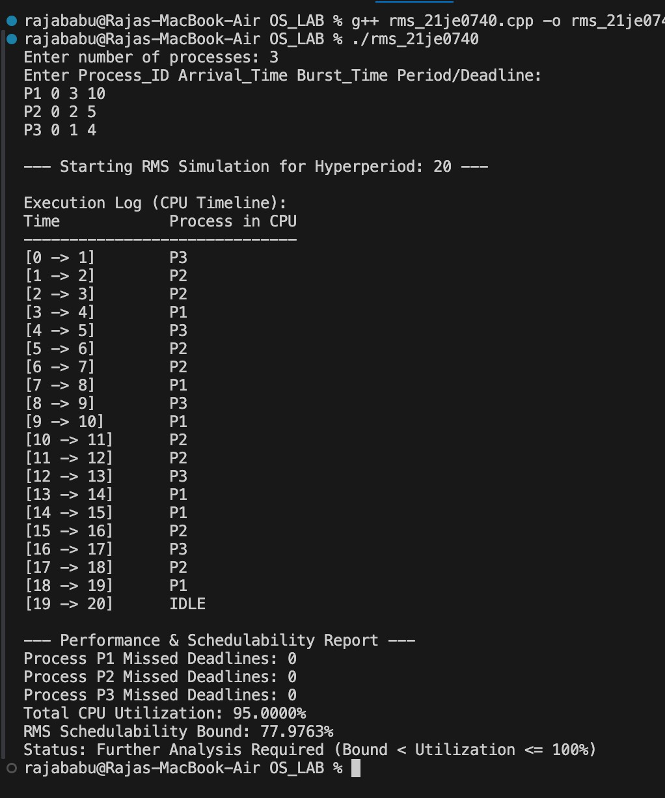

# OS Lab Project 2: Advanced Scheduling Algorithms

### Team Details

| S.No | Member Name | Admission Number | Contribution |
| :--- | :--- | :--- | :--- |
| 1 | Mohammad Umar Shaikh Mohd Abdul Sattar | 21JE0561 | Implemented Lottery Scheduling Algorithm |
| 2 | Raja Babu | 21JE0740 | Implemented Rate Monotonic Scheduling (RMS) Algorithm |
| 3 | Tak Abhishek Anil | 21JE0979 | Implemented Earliest Deadline First (EDF) Scheduling Algorithm |
| 4 | Udit Singh Chauhan | 21JE1002 | Implemented Multilevel Feedback Queue (MLFQ) Scheduling Algorithm and overall project integration |

## 1. Multilevel Feedback Queue (MLFQ)
The Multilevel Feedback Queue (MLFQ) is a dynamic priority scheduling algorithm designed to balance the needs of interactive and CPU-intensive processes. It maintains multiple queues, each with a different time quantum. Processes start at the highest priority and are demoted to lower levels if they exceed their time slice, ensuring short-lived tasks finish quickly without being blocked by longer ones.

### Sample Input
```text
Enter the number of queues: 3
Enter quantum for Q0: 2
Enter quantum for Q1: 4
Enter quantum for Q2: -1 (FCFS)

Number of processes: 4
Process Details (ID Arrival Burst):
P1 0 10
P2 1 4
P3 2 7
P4 4 2
```

### Output


## 2. Lottery Scheduler
The Lottery Scheduler is a proportional-share algorithm that uses a probabilistic approach to allocate CPU time. Each process receives a specific number of "lottery tickets," and for every time slice, a random ticket is drawn to select the winner. This ensures that every process has a non-zero probability of execution, preventing starvation while allowing higher-priority tasks (those with more tickets) to receive more CPU time on average.

### Sample Input
```text
Enter Number of Processes: 3
Enter Time Quantum: 2

ID  Arrival  Burst  Tickets
P1  0        6      70
P2  0        4      20
P3  0        2      10
```

### Output


## 3. Earliest Deadline First (EDF)
EDF is a dynamic priority real-time scheduling algorithm. It assigns priority based on absolute deadlines: the process with the closest deadline is scheduled first. This algorithm is optimal for preemptive uniprocessors. In a multiprocessor implementation, it manages concurrency across CPUs by sorting the global ready queue by the nearest deadlines.

### Sample Input
```text
Enter number of processors: 1
Enter number of processes: 3
Enter details (ID Arrival Burst Deadline):
P1 0 3 10
P2 0 6 12
P3 1 12 5
```

### Output


## 4. Rate-Monotonic Scheduling (RMS)

RMS is a static-priority real-time scheduling algorithm. Priorities are assigned based on the "rate" (frequency) of a task: processes with the shortest periods or cycles are given the highest priority. It is preemptive and typically used for periodic tasks. Unlike EDF, RMS uses fixed priorities that do not change during execution.

### Sample Input

```text
Enter number of processes: 3
Enter Process_ID Arrival_Time Burst_Time Period/Deadline:
P1 0 3 10
P2 0 2 5
P3 0 1 4
```

### Output

